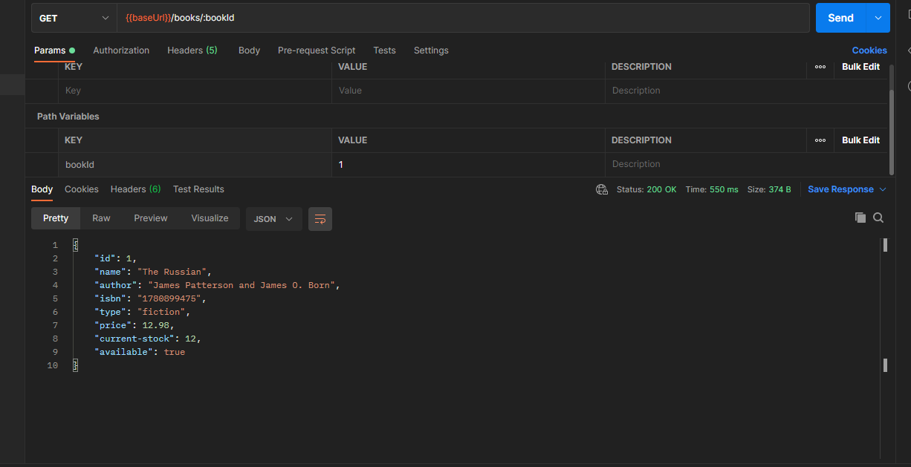

# This is the directory for the API TESTING using postman

- use this Link 🔗

https://github.com/vdespa/introduction-to-postman-course/blob/main/simple-books-api.md

### using simple book api🚀

- to set a variable select that endpoint set as variable
- initial value - that not use when you sending a request , when you share a collection it will share with that person,not private

- current value - is what the postman use when you send a request in postman . It is basically private to you

- we can use query parameters to filter out our response , we can use
  multiple parameter also according to the api documentation

- {{baseUrl}}/books/:bookId
  In this url the bookId is the path parameter or we can called it as
  path variable , we can edit the path variable value to 1 or 2 or any id

  

path variable are different from query parameter , path variable are the part of the path e.i the url

- Book order
- in order to create a order we need to make a post request , so inorder to make a post request the server must identify us ,so for this we can create a api-client in that server and use the access token to authorize ourself

- postman has different random variables that we can use to post request or do any api testing , e.i

```json{
  "bookId": 3,
  "customerName": "{{$randomFullName}}"
}
```

- we can see what we sent in the postman console😃

### when we use postman

- as we see we can use postman for communicating with apis
- we can't use postman for user interaction
- not use for performance testing
- not use for security testing , but you can use it for testing also

- Everything that starts with 2 like 200 is ok
- starts with 4 like 400 not good
- starts with 5 like 500 that's server issue not our😅

### Automate postman

- in the eye icon save as global variable and use it in {{variableName}}
